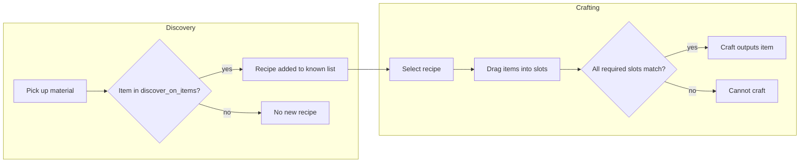
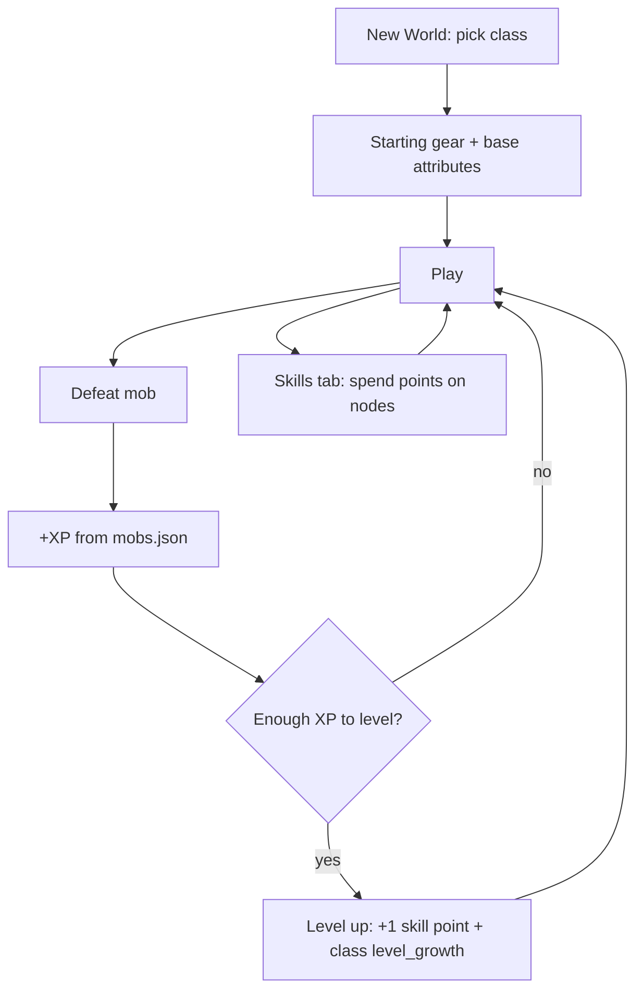

# Relictus

`Relictus` is a top-down dungeon crawler built with `pygame-ce`, featuring tile-based movement, animated combat, inventory/equipment, multi-level progression, checkpoint/death flow, save slots, and data-driven mobs/items.

## Tech Stack

- Python 3 + `pygame-ce`
- JSON-driven content for items and mobs
- Text tilemaps for levels
- Local file persistence for save worlds

## Project Structure

- `main.py` - game loop, state machine, level loading, save system, UI screens, targeting, transitions
- `sprites.py` - `Player`, `Mob`, `Wall`, dropped item behavior, mob combat/AI/animation
- `utils.py` - `Map`, `Camera`, `Spritesheet`, cooldown helper
- `inventory.py` - inventory slots, equipment logic, item stacking, damage/defense calculations
- `settings.py` - global constants for gameplay, rendering, controls, UI dimensions
- `data/items.json` - item definitions (stats, descriptions, effects, scaling, stack rules)
- `data/classes.json` - player classes (starting gear, growth, skill trees)
- `progression.py` - class helpers, XP curve, skill bonus math
- `data/mobs.json` - mob archetypes and drop tables
- `levels/*.txt` - level tilemaps and dungeon progression layout
- `images/*` - character/mob/wall spritesheets
- `saves/*.json` - per-world save files (auto-managed)

## Core Runtime Architecture

### `Game` state machine (`main.py`)

Game flow is driven by `self.state`:

- `intro` - title screen + world controls
- `playing` - gameplay update/draw loop
- `death` - death screen with respawn button

Additional modal states:

- `inventory_open` - pauses gameplay update, shows interactive inventory UI
- `pause_menu_open` - Esc pause menu with save actions
- `save_picker_open` - title overlay for choosing active save slot

### Main loop

`Game.run()` does:

1. process events
2. update only when not paused by modal screens
3. draw the active screen/state

## Rendering and Camera

### Camera (`utils.py`)

- Camera uses a world viewport of `(WIDTH / SCALE, HEIGHT / SCALE)` and converts to screen space.
- `Camera.apply()` and `Camera.apply_rect()` handle world -> screen transforms and scaling.
- Camera is intentionally **unclamped** so you can pan beyond map boundaries/walls.

### Draw order (`main.py`)

- Map + grid rendered first
- Tile overlays (checkpoint, exits, path preview, mob tile outlines)
- Sprites sorted by `(centery, centerx)` for stable layering
- HP bars on entities with health
- Target outline and mob range overlay
- HUD/hotbar/inventory/pause UI overlays

## Input and Controls

### Movement / Combat

- `WASD`: queue tile movement
- `Space`: attack (weapon required)
- `Delete`/`Backspace`: clear movement queue

### Inventory / Items

- `E` or `I`: open/close inventory
- `1-8`: select hotbar slot
- `F`: use selected consumable (e.g., potion)

### Menus / Display

- `Esc`: pause menu (when in gameplay), close picker
- `F11`: toggle fullscreen
- `Enter`: quick start/continue from title
- `N`: open **class picker**, then start a **new world** with that class
- `S`: open save picker from title

## Player System

Implemented in `sprites.py` (`Player` class):

- Tile-based queued movement with smooth interpolation (`slide_from -> slide_to`)
- Attack animation and cooldown timing
- Hit handling with hurt cooldown
- Derived stats from equipment:
  - effective attributes
  - effective max HP
  - effective weapon damage

Attack is blocked when no weapon is equipped.

## Mob System

Implemented in `sprites.py` (`Mob` class), data-driven from `data/mobs.json`.

### State flow

- `inactive` -> `idle` -> `walk` -> `attack` -> `dead`

### Behavior

- Activation range before waking up
- Tile chase with smooth sliding
- Timed attack animation with configurable hit frame
- Death animation and drop generation
- Left/right flip based on movement direction

### Data-driven mob configuration

For each mob type:

- sprite sheet file + frame size
- number of frames per row (idle/walk/attack/death)
- hp, damage, move timings, chase/attack/activation ranges
- drop table

Current types:

- `statue` (stone sentinel)
- `shadow_assassin` (rogue-based enemy using `rogue.png`)

## Inventory and Equipment

Implemented in `inventory.py` and drawn/interacted in `main.py`.

### Storage model

- Slot list for inventory (`(item_id, count)` or `None`)
- Equipment dictionary for `weapon`, `head`, `chest`, `boots`, `shield`
- Hotbar is the first N inventory slots

### Interaction model

- Hover tooltips with item stats/effects
- Click to highlight slot
- Drag-and-drop swapping between slots
- Right-click equip/unequip
- Stack counts drawn with dark number badge for readability

### Consumables

- `F` uses selected hotbar consumable
- Potion consumption only applies when healing is possible

### Combat stat integration

- Weapon damage scales from base damage + attribute scaling in item defs
- Defense and stat bonuses aggregate from equipped items

## Items Data (`data/items.json`)

Each item supports fields like:

- `name`, `type`, `description`
- `stackable`, `max_stack`
- `slot` (for equipment)
- `base_damage`, `scaling_stat`, `scaling_factor`
- `defense`, `stat_bonus`
- `effect` (consumables)

Includes starter legionnaire gear and multiple weapon archetypes.

## Crafting and recipe discovery

Definitions live in `data/crafting.json` (loaded by `crafting.py`).

- **Weapon types** define **slot layouts** (e.g. sword: hilt, blade, handle, magic; dagger: blade, handle, magic).
- Each **recipe** has a stable `id`, `display_name`, optional `starts_known`, `discover_on_items` (recipe appears when you pick up those materials), `weapon_type`, `inputs` (slot → item id or `null`), and `output` (`item_id`, `count`).
- The **Craft** tab lists known recipes; drag items from the bag into the weapon-type slots, then craft.

### Crafting flow (Mermaid)



## Classes, XP, leveling, and skill trees

- **Classes** are defined in `data/classes.json` (see `progression.py`). Each has `base_attrs`, per-level `level_growth`, `starting_inventory` (`items` + `equipment`), and a `skill_nodes` list (each node: `id`, `name`, `description`, `min_level`, optional `requires` node ids, `stat_bonus`).
- On **New World**, you choose a class; starting loadout and base stats follow that class.
- **XP** is granted when a mob dies (see `xp` on each mob in `data/mobs.json`). When current XP reaches the threshold for your level (`xp_for_next_level` in `progression.py`), you level up: **+1 skill point per level**, base attributes grow by class `level_growth`, and stats are recomputed.
- **Skill points** are spent on the **Skills** inventory tab; bonuses stack into `get_effective_attrs()` alongside equipment.

### Progression overview (Mermaid)



## Levels, Doors, and Progression

Level files live in `levels/` and are loaded in order:

- `level1.txt` -> `level2.txt` -> `level3.txt`

### Supported map tiles

- `1` - wall
- `P` - player spawn
- `K` - checkpoint
- `M` - statue mob spawn
- `A` - shadow assassin mob spawn
- `N` - forward exit (locked until level clear)
- `R` - return exit (always available)
- `.` and other non-reserved chars - walkable floor

### Door/exit logic

- Forward exits (`N`) render as walls while locked.
- When all live mobs in level are cleared, exits unlock and become purple doorway tiles.
- Stepping on unlocked `N` loads next level.
- Stepping on `R` loads previous level.

## Checkpoint and Death Flow

- Checkpoint comes from `K` tile (or spawn fallback)
- On player HP <= 0:
  - switch to death screen
  - show respawn button
- Respawn:
  - move player to checkpoint
  - reset motion/attack state
  - restore effective full HP
  - resume gameplay

## Save System (Multi-World)

Implemented in `main.py` with per-world JSON saves in `saves/`.

### Files

- `saves/world_XXX.json` - each world save
- `saves/active_world.txt` - currently selected world id

### Saved data

- inventory slots
- equipment
- selected hotbar index
- player health
- current level
- per-level live mob snapshots (position, state, hp, type)
- `player_class_id`, `player_level`, `player_xp`, `skill_points`, `purchased_skill_nodes`
- `discovered_recipes`

### Title menu world controls

- `Start / Continue` - play active world
- `New World` - pick **class** (Legionnaire / Assassin / Arcanist), then create a new save and start with that role’s **starting gear**
- `Choose Save` - open picker and switch active world

Legacy migration:

- old `save_inventory.json` is auto-migrated into `saves/world_001.json` if needed.

## UI Screens

### Title screen

- Main menu with world actions and active save indicator
- optional save-picker overlay list

### Pause menu (`Esc`)

- Save Game
- Save & Quit to Title
- Resume

### HUD

- Health bar + values
- Level + XP bar toward next level
- Attack cooldown/readiness bar

### Inventory screen

- Tabs: **Character** | **Skills** | **Craft**
- Player preview
- Equipment slots + labels
- Stats and derived combat values (class + level growth + equipment + skills)
- **Skills**: spend skill points on class nodes (level + prerequisite gates)
- Inventory grid + hotbar highlighting
- Tooltips and drag ghost

## Running the Game

From project root:

```bash
python main.py
```

## Notes for Extending

- Add new mob types by editing `data/mobs.json` and placing spawn chars in level files (`main.py` parser).
- Add new items by editing `data/items.json`; inventory/UI/tooltips update automatically.
- Add levels by creating `levels/levelX.txt` and appending filename to `self.level_order` in `main.py`.
