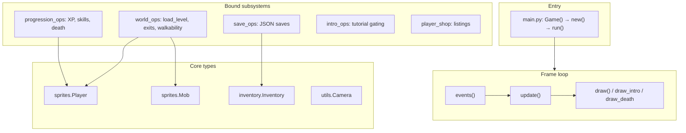
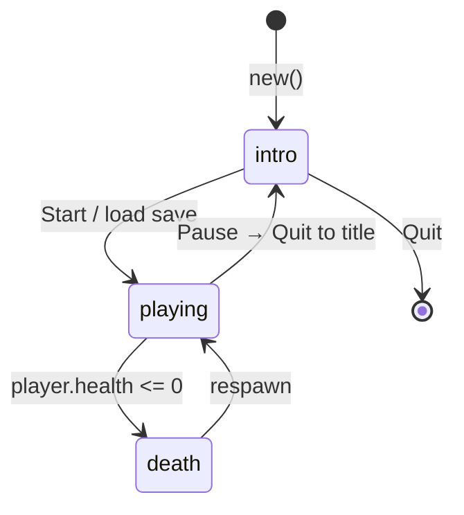
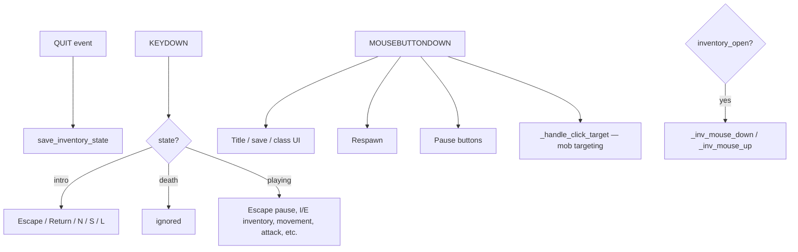
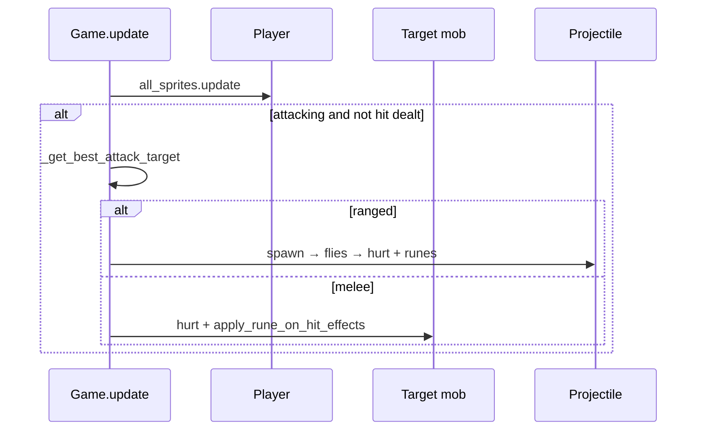
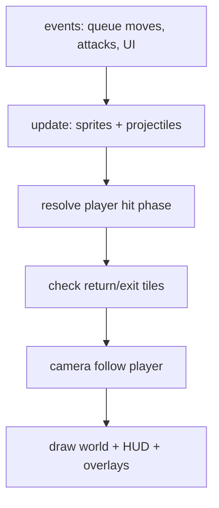

# Relictus — codebase guide

Top-down dungeon crawler built with **Python 3** and **Pygame**. The game name and window title come from `settings.TITLE` (`"Relictus"`). This document maps **every Python module**, major **classes and functions**, and how **input, UI, combat, saves, and progression** connect.

## Run the game

```bash
python main.py
```

**Dependency:** `pygame` (install with `pip install pygame`).

From the title screen, **L** launches `level_editor.py` in a separate process (if the file exists).

---

## Repository layout

| Path | Role |
|------|------|
| `main.py` | `Game` class: event loop, rendering orchestration, HUD, inventory UI, combat hooks, death/intro/pause screens. At import time, many `Game` methods are **replaced** by `game.systems.*` (see [Subsystem binding](#subsystem-binding)). |
| `settings.py` | Constants: resolution, zoom (`SCALE`), tile size, player/mob/combat timings, colors, HUD/inventory layout keys, death penalties, attribute baselines. |
| `utils.py` | `Map`, `Camera`, `Spritesheet`, `Cooldown`, grid line-of-sight (`tiles_on_grid_line`), UI helpers (`draw_corner_brackets`, `draw_lightning_bolt`), PNG transparency fix (`key_checkerboard_placeholder`). |
| `sprites.py` | `Player`, `Mob`, `Wall`, `Projectile`, `DroppedItem`, `Coin`; `MOB_DEFS` from `data/mobs.json`; `roll_mob_drops`, collision helpers. |
| `inventory.py` | `ITEM_DEFS` from `data/items.json`; `Inventory` (bag, hotbar, equipment, craft/upgrade/shop staging); `pack_slot` / `unpack_slot`; weapon stat resolution via `weapons.py`. |
| `weapons.py` | Ranged vs melee, damage from attrs + scaling, cooldown, range in tiles/px, on-hit / rune blessing resolution and tooltip text. |
| `crafting.py` | `RECIPES` / `WEAPON_TYPES` from `data/crafting.json`; recipe discovery, staging validation, craft completion, rune infusion rules (`try_finish_infusion`). |
| `progression.py` | Loads `data/classes.json`; XP curve, skill node bonuses, unlock rules, per-level base attributes. |
| `game/systems/world_ops.py` | Level load order (starts at `intro.txt`), `load_level`, walkability, exits, mob restore/snapshot wiring, camera, BFS reachability. |
| `game/systems/save_ops.py` | Save slots under `saves/`, `active_world.txt`, JSON persistence, legacy migration, inventory/progression hydration. |
| `game/systems/progression_ops.py` | XP gain, skill purchase, mob-kill XP, death penalties, starting gear, skill bonuses on `Game`. |
| `game/systems/intro_ops.py` | Intro level id, starter chest loot from class, exit gating conditions. |
| `game/systems/player_shop.py` | `data/player_shop.json` listings; buy/sell with gold coins. |
| `level_editor.py` | Standalone editor for `levels/*.txt` (same tile semantics as `load_level`). |
| `data/` | `items.json`, `mobs.json`, `classes.json`, `crafting.json`, `player_shop.json`, etc. |
| `levels/` | ASCII maps consumed by `Map` / `load_level`. |
| `saves/` | Per-world `world_NNN.json` + `active_world.txt`. |
| `images/` | Spritesheets referenced by code (`knight.png`, walls, mob sheets). |

---

## Architecture overview



---

## Subsystem binding

At the **bottom of `main.py`**, methods are assigned onto `Game` so gameplay logic lives in `game/systems` without changing call sites:

- **World:** `load_data`, `is_walkable`, `tile_blocks_line_of_sight`, `has_line_of_sight_tiles`, `load_level`, `_compute_reachable_tiles_from`, `go_to_next_level`, `go_to_prev_level`
- **Progression:** `get_skill_attr_bonuses`, `_recompute_player_base_attrs_from_progression`, `_apply_starting_gear_for_class`, `add_player_xp`, `try_purchase_skill_node`, `on_mob_kill`, `_apply_death_penalties`
- **Saves:** `init_save_system`, `set_active_world`, `_load_world_state_from_save`, `create_new_world`, `list_save_files`, `delete_save`, `select_world`, `_snapshot_current_level_mobs`, `save_inventory_state`, `load_inventory_state`, recipe helpers, `_initialize_player_inventory`, etc.

`Game.__init__` and methods like `events`, `update`, `draw`, and the full inventory UI remain in `main.py`.

---

## Game states and main loop



- **`run()`** — Fixed timestep via `clock.tick(FPS)`; `dt` in seconds for movement and FX.
- **`intro`** — Title UI, save picker, new-world class picker; **no** `update()` (world frozen).
- **`playing`** — `update()` runs only when inventory and pause menu are **closed**.
- **`death`** — Shows penalties; `update()` skipped until respawn.

---

## Event handling

Keyboard and mouse flow through **`Game.events()`** in `main.py`. Order matters: early `continue` branches skip later handlers.



### Playing-state keyboard (high level)

| Input | Behavior |
|--------|-----------|
| **Escape** | Opens pause menu (closes inventory, clears drag/staging) or closes pause. |
| **I** | Toggle inventory (`INVENTORY_KEY`). |
| **E** | Same overlay, character-focused entry (`CHARACTER_KEY`). |
| **1–8** | Hotbar selection. |
| **Space** | `player.attack()` (requires equipped or selected weapon — unarmed does nothing). |
| **F** | `use_selected_item()` — equip from hotbar or consume consumables (e.g. heal). |
| **G** | `try_interact_chest()` when adjacent to a chest. |
| **Delete / Backspace** | Clear movement queue. |
| **WASD / arrows** | `queue_move` — tile steps queued, executed as smooth slides. |

### Mouse

- **Left click (playing, UI closed)** — Picks nearest mob under cursor as **`manual_target`**; empty space clears it. Used by `_get_best_attack_target()` when valid and in range.
- **Inventory open** — Drag-and-drop between bag, hotbar, equipment, craft grid, upgrade slots, shop staging; tooltips on hover.

---

## World model and level format

- **`utils.Map`** — Reads a text file; each row is a string of tile characters; `tilewidth` / `tileheight` derive from the grid.
- **`world_ops.load_level`** — Builds `map_img` (floor fill + walls), spawns entities from tiles:

| Tile | Meaning |
|------|---------|
| `.` | Floor |
| `1` | Wall (`Wall` sprite) |
| `P` | Player spawn (also default checkpoint if no `K`) |
| `K` | Checkpoint respawn |
| `N` | Forward exit (locked until conditions met) |
| `R` | Return to previous level |
| `C` | Chest (drawn interactively; loot from JSON / intro rules) |
| `M` | Mob `statue` |
| `A` | `shadow_assassin` |
| `G` | `ghost` |
| `D` | `training_dummy` |

- **`is_walkable(col, row)`** — Bounds, not wall, exit gate open if `N`, not occupied by player (including slide target) or mob.
- **`tile_blocks_line_of_sight`** — Walls and closed `N` block Bresenham LOS used by mobs.
- **`_compute_reachable_tiles_from`** — BFS from spawn; mob spawns outside the flood-fill are skipped (prevents broken placements).
- **Level order** — `intro.txt`, then `level1.txt` … `level9.txt` (see `world_ops.load_data`).

---

## Combat

### Player

- **Movement** — Queue-based tile steps; **`Player.update`** interpolates position (`slide_duration_ms` from speed). Cannot start a new slide while **`attacking`**.
- **Attack** — `Player.attack()` checks weapon from inventory (`get_effective_weapon_item_id`), cooldown (`get_attack_cooldown_ms`), then plays attack frames. **`Game.update`** applies damage once per swing when `attacking` and not `attack_hit_dealt`:
  - **Melee** — `_get_best_attack_target()` (manual target if valid, else nearest in range), `_roll_player_hit_damage()`, `mob.hurt`, `apply_rune_on_hit_effects`.
  - **Ranged** (`staff` / `bow` in item data) — `_spawn_player_projectile` → **`Projectile`** homes to target, respects max range, walls, and collision with target; on hit applies damage + rune effects.
- **Damage** — `get_effective_damage()` uses weapon base, strength, scaling stat/factor; ranged multiplied by `RANGED_WEAPON_DAMAGE_MULT` in `weapons.py`.
- **Range** — `attack_range_tiles` on weapon → pixels via `TILESIZE`.
- **Hurt** — `PLAYER_HURT_COOLDOWN` i-frames; floating damage numbers via `Game.add_damage_number`.

### Mobs (`Mob`)

- **Data-driven** from `data/mobs.json` (`MOB_DEFS`): HP, damage, cooldown, ranges, animation rows, optional heal phase, soul steal on hit, drops.
- **States** — `inactive` (idle art, no AI until player within activation radius **and** LOS) → `idle` / `walk` / `attack` / `heal` / `dead`.
- **AI** — Chase if within chase range and LOS; move one tile per effective delay (Neptune slow increases delay); attack when in tile-radius range and cooldown ready; hit on configured animation frame (`mob_hit_frame`).
- **Status** — Burn DoT (Vulcan), slow (Neptune); drawn as corner brackets on the sprite.
- **Death** — Death animation, then `roll_mob_drops` → **`DroppedItem`** on ground.

### Targeting and telegraphs

- **`_get_best_attack_target`** — Prefers **`manual_target`** if alive and within weapon range; else closest mob in range (pixel distance between hit rects).
- **Draw** — Green/red outline on selected mob; **mob attack range** tiles tinted with translucent overlay (`MOB_ATTACK_OVERLAY`). Player move path outlined in yellow.



### Rune / on-hit effects (`apply_rune_on_hit_effects`)

Resolved via `weapons.resolve_on_hit_effect` (weapon + optional **`infused_rune`** in equipment meta):

| `kind` | Effect |
|--------|--------|
| `burn_on_hit` | DoT ticks on mob |
| `slow_on_hit` | Reduces mob move speed for a duration |
| `chain_damage` | Jupiter chain: fraction of damage to nearest other mob in tile radius + lightning FX |
| `lifesteal_on_hit` | Chance to heal player for fraction of damage dealt |

---

## GUI and HUD

```mermaid
flowchart LR
    subgraph world_layer [World layer]
        map_view[Scaled map + grid]
        sprites[Sorted sprites + HP bars]
        fx[Damage numbers, chain lightning]
    end
    subgraph hud_layer [HUD]
        hud[draw_hud — health, XP, attack CD, hints]
        dungeon[_draw_top_right_dungeon_panel — floor, minimap]
        hotbar[draw_hotbar]
    end
    subgraph overlays [Overlays]
        inv[draw_inventory — tabs]
        pause[draw_pause_menu]
        intro_ui[draw_intro / save / class pickers]
        death_ui[draw_death]
    end
    world_layer --> hud_layer --> overlays
```



- **`draw_hud`** — Top-left: health bar, XP to next level, attack cooldown bar, contextual key hints.
- **Dungeon panel** — Floor index, minimap (click to expand per settings), live mob count; optional shield-mob trail helper.
- **`draw_inventory`** — Dark overlay; tabs: **character** (stats, equipment, paper doll slots), **skills** (tree pages, unlock with skill points), **craft** (recipe list + ingredient slots + craft button), **upgrade** (weapon + rune + infusion), **shop** (player shop buy/sell from `player_shop.json`). Rarity tints from `settings.RARITY_SLOT_BG`. Tooltips: `_draw_tooltip` (stats, salvage hint for weapons).
- **Intro** — `_draw_intro_walkthrough_panel`, chest prompt `_draw_chest_interact_prompt` when near chests.
- **Pause** — Resume, save, quit to title (returns staging items, saves).

Key **`main.py`** UI helpers: `draw_slot`, `get_item_sprite_scaled`, `_inv_hit_test`, `_inv_mouse_down`, `_inv_mouse_up`, `_drop_onto_craft_slot`, tab buttons, skill node rects.

---

## Inventory system (`inventory.py`)

- **Slots** — `None` or `(item_id, count)` or `(item_id, count, meta_dict)`; **`meta`** holds e.g. `infused_rune` on forged weapons.
- **`add_item` / `remove_item` / `remove_item_by_id`** — Stack rules respect `stackable` in item defs.
- **Equipment slots** — `weapon`, `head`, `chest`, `boots`, `shield`; stat bonuses from armor/shield; weapon drives attack.
- **`get_effective_weapon_item_id`** — Equipped weapon, else weapon-type item in **selected hotbar** slot (so hotbar can drive combat without equipping).
- **Staging** — Craft ingredients (`_craft_placements`), infusion (`_upgrade_weapon_item_id`, `_upgrade_rune_item_id`), shop sell (`_shop_sell_staged`); **`return_*`** methods restore items when closing UI.
- **Salvage** — `apply_salvage_from_weapon` / `try_salvage_*` — destroy weapon for rolled materials from item `salvage` table.

---

## Crafting and infusion (`crafting.py` + UI)

- Recipes in **`data/crafting.json`**: inputs per slot, counts, output, `starts_known`, `discover_on_items`.
- **`try_finish_craft`** — Validates staged slots, consumes items, adds output.
- **`try_finish_infusion`** — Requires weapon with `augment_output`, rune item, enough `gold_coin` for `augment_coin_cost`; produces new item with meta linking the rune.

---

## Progression (`progression.py` + `progression_ops.py`)

- **Classes** — `data/classes.json`: `base_attrs`, `level_growth`, `starting_inventory`, `skill_nodes` (prereqs, min level, `stat_bonus`).
- **XP** — `xp_for_next_level`; level-ups grant **skill points** and refresh base attrs; `player.recalc_stats()` updates max HP.
- **`on_mob_kill`** — XP from `mobs.json`; intro **training dummy** can grant enough XP to reach the next level threshold so the tutorial can teach leveling.
- **Death** — `_apply_death_penalties`: lose a fraction of gold coins and current XP bar (`DEATH_GOLD_LOSS_PCT`, `DEATH_XP_LOSS_PCT`), with floor at level 1 / 0 XP.

---

## Intro level (`intro_ops.py`)

- **`is_intro_level`** — `current_level_name == 'intro.txt'`.
- **Starter chest** — Fixed tiles in `STARTER_CHEST_TILES`; loot mirrors class starting gear via `class_starter_loot_entries`.
- **Exit open** — Requires: starter chest opened, **at least one skill node purchased**, and **no living mobs** (`refresh_intro_exit_open`). Docstrings elsewhere may mention extra tutorial steps; this is what the code enforces for `level_exit_open`.

---

## Player shop (`player_shop.py`)

- Listings loaded from **`data/player_shop.json`**: `item_id`, `price_coins`, `min_player_level`.
- **`listing_state`** — Computes locked / affordable / already-owned (non-stackables).
- **`try_buy_player_listing`** / **`try_sell_staged_item`** — Called from inventory UI mouse handler.

---

## Saves (`save_ops.py`)

- **`saves/world_NNN.json`** stores: bag `slots`, `hotbar`, `equipment`, `equipment_meta`, `selected_hotbar_index`, `player_health`, `current_level`, **`mob_states`** (per-level mob snapshots), `discovered_recipes`, class, level, XP, skill points, purchased nodes, `opened_chests`, `intro_exit_unlocked`.
- **`active_world.txt`** — Name of the JSON file to load on startup.
- **`create_new_world`** — New filename, resets progression, loads first level, applies starting inventory.
- **`select_world`** — Switches active save and reloads from disk state.
- **Legacy** — Old `save_inventory.json` may be migrated to `world_001.json` once.

---

## `utils.py` reference

| Symbol | Purpose |
|--------|---------|
| `Map` | Load level grid from file |
| `Camera` | View rect in world space, `SCALE` zoom, `apply` / `apply_rect` to screen |
| `Spritesheet` | Crop rectangles from a sheet image |
| `Cooldown` | Simple ms timer (`start`, `ready`) |
| `tiles_on_grid_line` | Bresenham for LOS |
| `key_checkerboard_placeholder` | Make specific gray pixels transparent |
| `draw_corner_brackets` | Status effect frame on mobs |
| `draw_lightning_bolt` | Jupiter chain visual |

---

## `sprites.py` reference

| Symbol | Purpose |
|--------|---------|
| `MOB_DEFS` | Loaded mob templates |
| `collide_hit_rect` / `collide_with_walls` / `collide_mob_walls` | Collision callbacks |
| `Player` | Movement queue, slide, attack animation, stats hooks |
| `Mob` | Full AI, animations, statuses, drops |
| `Wall` | Static collider sprite |
| `Projectile` | Ranged hit detection and rune application |
| `DroppedItem` | Pickup when player overlaps |
| `Coin` | Simple placeholder sprite (if used in levels) |
| `roll_mob_drops` | Probabilistic drops from mob def |

---

## `level_editor.py`

Standalone Pygame app editing the same character grid as the main game. **E** toggles tile vs mob mode; hotbar **1–8** selects palette entries; paint with LMB, erase with RMB; **Ctrl+S** save, **Ctrl+O** cycle levels. See the module docstring for the full control list.

---

## `settings.py` (grouped)

- **Display:** `WIDTH`, `HEIGHT`, `SCALE`, `TILESIZE`, `FPS`, colors, `BGCOLOR`, grid/minimap/HUD dimensions.
- **Player:** speed, hit rect, anim/attack speeds, default damage/range/cooldown, projectile constants, move queue cap.
- **Mobs:** activation/chase/attack ranges, timings, slide duration, HP bar sizes.
- **UI:** inventory grid (`INVENTORY_COLS`/`ROWS`), hotbar size, rarity colors, key bindings `INVENTORY_KEY` / `CHARACTER_KEY`.
- **Progression:** `PLAYER_BASE_ATTRS`, HP-per-health-stat, dexterity speed bonus (if used by systems), death loss percentages.

This file is the single source of truth for tuning **feel** without hunting through logic.

---

## End-to-end data flow (one frame, playing)



For questions about a **specific function**, search the name in the file listed in the [Repository layout](#repository-layout) table; `main.py` remains the hub for **input**, **drawing**, and **combat resolution** after sprites update.
